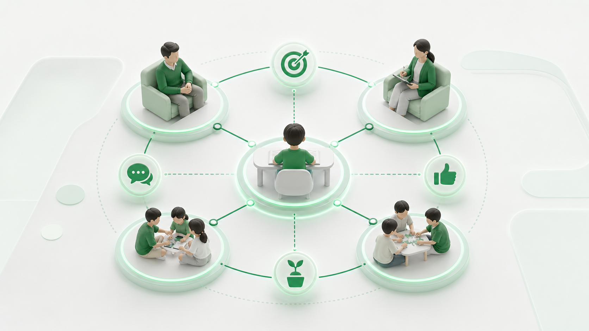

# Module 05: Phương pháp dạy học và vai trò phụ huynh

**Phụ huynh homeschooling không cần trở thành giáo viên mọi môn, nhưng phải trở thành người thiết kế môi trường và quản lý phản hồi.**

## 1. Vai trò thật của phụ huynh

| Vai trò | Việc cần làm | Không nên làm |
|---|---|---|
| Kiến trúc sư học tập | Xác định mục tiêu, tài nguyên, lịch, mentor. | Ôm hết mọi môn dù thiếu năng lực. |
| Người quan sát | Ghi nhận dấu hiệu học, cảm xúc, xã hội. | Dán nhãn trẻ bằng một vài hành vi. |
| Huấn luyện viên thói quen | Giúp trẻ lập kế hoạch, bắt đầu, hoàn thành. | Kiểm soát từng phút. |
| Người bảo vệ | Theo dõi an toàn, sức khỏe, quyền lợi trẻ. | Hy sinh trẻ cho lý tưởng của người lớn. |
| Người kết nối | Tìm cộng đồng, chuyên gia, nhóm học. | Cô lập gia đình khỏi phản hồi ngoài. |

## 2. Các phương pháp có thể phối hợp

| Phương pháp | Bản chất | Dùng tốt khi | Cảnh báo |
|---|---|---|---|
| Direct instruction | Dạy rõ từng bước. | Kỹ năng nền tảng, kiến thức mới. | Không kéo dài thành nghe giảng thụ động. |
| Socratic questioning | Hỏi để trẻ tự làm rõ lập luận. | Văn, lịch sử, đạo đức, khoa học. | Hỏi quá khó làm trẻ bối rối. |
| Mastery learning | Luyện đến mức đạt chuẩn rồi mới đi tiếp. | Toán, đọc, viết, ngoại ngữ. | Có thể chậm nếu chuẩn quá chi tiết. |
| Project-based learning | Học qua sản phẩm/dự án. | Kết nối môn học với đời sống. | Cần rubric để tránh vui mà nông. |
| Apprenticeship | Học qua làm cùng người có kinh nghiệm. | Nghề, nghệ thuật, nghiên cứu, kỹ năng sống. | Cần chọn mentor an toàn và có đạo đức. |
| Self-directed learning | Trẻ tự đặt mục tiêu và quản lý học. | Trẻ đã có nền tảng tự điều chỉnh. | Không phù hợp nếu trẻ chưa có kỹ năng học. |

## 3. Cách chọn phương pháp

Không hỏi “phương pháp nào hay nhất?”. Hỏi:

- Mục tiêu học là kiến thức, kỹ năng, thái độ hay sản phẩm?
- Trẻ đã có nền tảng nào?
- Sai lầm thường gặp là gì?
- Cần phản hồi nhanh hay trải nghiệm dài?
- Phụ huynh có đủ năng lực dạy trực tiếp không, hay cần mentor?

## 4. Phản hồi tốt

Phản hồi tốt mô tả khoảng cách giữa hiện tại và mục tiêu, rồi chỉ bước tiếp theo. Phản hồi kém đánh giá con người: “con thông minh”, “con lười”, “con không có năng khiếu”.

| Phản hồi kém | Phản hồi tốt hơn |
|---|---|
| Bài này sai nhiều quá. | Con đang sai ở bước đổi đơn vị; mình luyện riêng bước đó. |
| Con viết chán. | Đoạn này có ý, nhưng thiếu ví dụ và câu chuyển. |
| Con không tập trung. | Sau 15 phút con bắt đầu nhìn ra ngoài; ta thử chia buổi thành 12 phút. |

## 5. Bài tập

Chọn một môn phụ huynh đang dạy và viết lại vai trò:

```text
Phần tôi dạy trực tiếp:
Phần trẻ tự học:
Phần cần mentor:
Phần cần nhóm bạn:
Phần cần sản phẩm thật:
Phần tôi sẽ đánh giá bằng rubric:
```

## 6. Tình huống ứng dụng

Phụ huynh giỏi tiếng Anh nên tự dạy con mọi buổi. Sau vài tuần, con trả lời miễn cưỡng, phụ huynh khó chịu vì con “không hợp tác”. Khi học với giáo viên khác, con lại tham gia tốt hơn.

**Vấn đề thật:** phụ huynh nhầm năng lực chuyên môn với năng lực dạy học và nhầm quan hệ cha mẹ - con với quan hệ giáo viên - học sinh. Trong homeschooling, vai trò phải được thiết kế, không mặc định.


*Caption: Hình này nhắc rằng phụ huynh không cần trở thành giáo viên mọi môn; việc quan trọng hơn là thiết kế đúng vai trò và nguồn phản hồi.*

## 7. Mô hình tư duy: Ma trận vai trò

| Nhiệm vụ | Phụ huynh làm | Mentor làm | Trẻ làm | Nhóm bạn làm |
|---|---|---|---|---|
| Mục tiêu | Định hướng và ưu tiên. | Góp ý chuyên môn. | Nêu sở thích và khó khăn. | Tạo chuẩn ngang hàng. |
| Dạy nền tảng | Có thể dạy phần phù hợp. | Dạy phần sâu/khó. | Luyện tập. | Cùng ôn và thực hành. |
| Phản hồi | Quan sát thói quen. | Sửa kỹ thuật. | Tự sửa. | Phản hồi sản phẩm. |
| Động lực | Giữ nhịp và quan hệ. | Tạo thử thách. | Chọn mục tiêu nhỏ. | Tạo cam kết xã hội. |


*Caption: Bốn vai trò quanh người học cho thấy chất lượng homeschooling phụ thuộc vào phân vai, không phụ thuộc vào việc một người lớn làm tất cả.*

## 8. Workflow chọn phương pháp

1. Gọi tên mục tiêu học: biết, hiểu, làm, tạo sản phẩm hay hình thành thói quen.
2. Xác định lỗi thường gặp của trẻ.
3. Chọn phương pháp phù hợp mục tiêu, không chọn theo trào lưu.
4. Quyết định ai là người dạy/phản hồi tốt nhất.
5. Thiết kế một vòng học ngắn: dạy, làm, phản hồi, sửa.
6. Đo xem quan hệ và kết quả có tốt hơn không.


*Caption: Hình này hỗ trợ phụ huynh chọn phương pháp theo mục tiêu, lỗi thường gặp và người phản hồi phù hợp thay vì theo trào lưu.*

## 9. Rubric đầu ra

| Mức | Dấu hiệu |
|---|---|
| Chưa đạt | Phụ huynh ôm hết hoặc giao hết cho app/khóa học. |
| Đạt | Có phân vai giữa phụ huynh, trẻ, mentor và tài nguyên. |
| Xuất sắc | Vai trò được điều chỉnh theo dữ kiện học tập, sức khỏe quan hệ và chất lượng phản hồi. |
