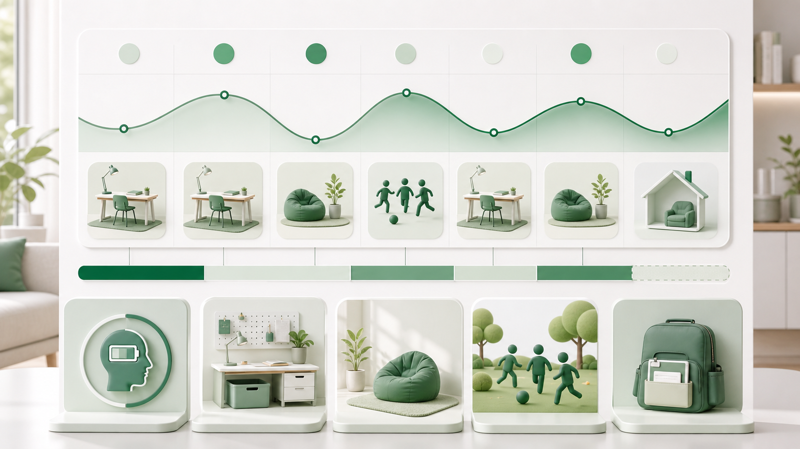
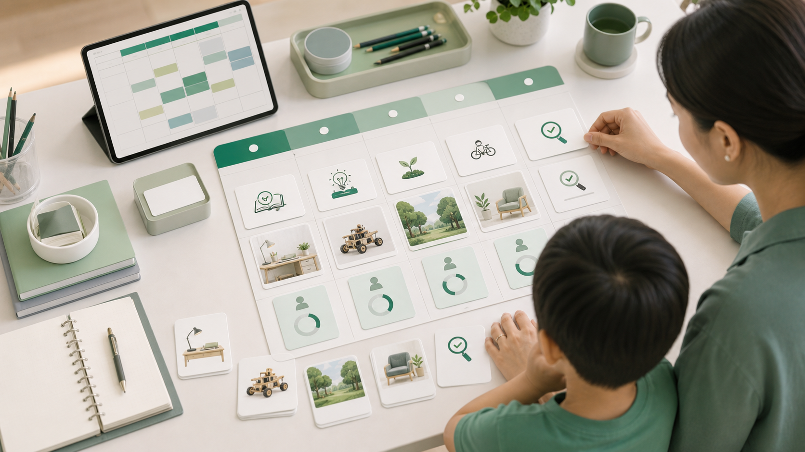

# Module 06: Môi trường, lịch học và nhịp sống gia đình

**Homeschooling bền vững khi nó trở thành một nhịp sống có cấu trúc, không phải chuỗi quyết tâm ngắn hạn.**

## 1. First principles

**Bản chất:** Môi trường dạy trước khi người lớn dạy. Thứ gì dễ thấy, dễ chạm, dễ bắt đầu, dễ hoàn thành và được phản hồi đều có khả năng trở thành hành vi lặp lại.

**Cơ chế:** Trẻ cần nhịp dự đoán được để giảm mâu thuẫn, nhưng cũng cần khoảng mở để khám phá. Lịch học tốt không kín; nó tạo đủ nhịp cho nền tảng, đủ không gian cho dự án, đủ thời gian cho cơ thể và quan hệ.

## 2. Thiết kế môi trường

| Yếu tố | Câu hỏi | Gợi ý |
|---|---|---|
| Không gian | Trẻ học ở đâu là ít nhiễu nhất? | Một góc bàn rõ, ánh sáng tốt, ít thiết bị gây xao nhãng. |
| Học liệu | Trẻ có tự lấy và cất được không? | Kệ sách, hộp vật liệu, danh sách tài nguyên. |
| Công nghệ | Thiết bị phục vụ hay điều khiển lịch học? | Quy định giờ online, chặn nhiễu, có người theo dõi. |
| Dấu hiệu bắt đầu | Điều gì báo hiệu vào nhịp học? | Bảng kế hoạch, đồng hồ, nghi thức ngắn. |
| Dấu hiệu kết thúc | Khi nào trẻ biết đã xong? | Checklist, sản phẩm, câu phản tư. |

## 3. Lịch ngày và lịch tuần

| Loại lịch | Phù hợp khi | Cấu trúc |
|---|---|---|
| Block schedule | Gia đình cần nhịp ổn định. | Sáng nền tảng, chiều dự án/vận động, tối đọc. |
| Loop schedule | Có nhiều môn không cần học mỗi ngày. | Xoay vòng khoa học, lịch sử, nghệ thuật, kỹ năng sống. |
| Project week | Trẻ làm sản phẩm lớn. | 1-2 kỹ năng nền tảng mỗi ngày, phần còn lại cho dự án. |
| Hybrid week | Có lớp ngoài hoặc mentor. | Lịch gia đình xoay quanh các buổi cố định ngoài nhà. |

## 4. Ranh giới gia đình

Homeschooling đưa giáo dục vào nhà, nên nếu không có ranh giới, xung đột học tập có thể ăn vào quan hệ cha mẹ - con cái. Gia đình cần phân biệt giờ học, giờ chơi, giờ việc nhà, giờ nghỉ và giờ kết nối không đánh giá.

| Dấu hiệu quá tải | Điều chỉnh |
|---|---|
| Phụ huynh cáu gắt hằng ngày | Giảm tải, thuê hỗ trợ, đổi phương pháp. |
| Trẻ khóc hoặc phản kháng kéo dài | Kiểm tra độ khó, lịch ngủ, quan hệ, sức khỏe. |
| Lịch luôn vỡ | Lịch quá tham hoặc thiếu ưu tiên. |
| Không có sản phẩm học tập | Cần mục tiêu nhỏ và vòng hoàn thành rõ hơn. |

## 5. Một tuần thử nghiệm

Thay vì tuyên bố homeschooling cả năm, hãy chạy một chu kỳ 4 tuần:

1. Tuần 1: đo điểm hiện tại và thiết lập lịch nhẹ.
2. Tuần 2: thêm sản phẩm nhỏ và phản hồi.
3. Tuần 3: thêm hoạt động xã hội ngoài nhà.
4. Tuần 4: rà soát dữ kiện, cảm xúc, tiến bộ và quyết định điều chỉnh.

## 6. Tình huống ứng dụng

Gia đình có lịch học rất đẹp trên giấy: 8h toán, 9h tiếng Anh, 10h đọc, chiều dự án. Sau một tuần, lịch vỡ vì trẻ ngủ muộn, phụ huynh họp đột xuất, em nhỏ làm ồn và bài toán kéo dài quá lâu.

**Vấn đề thật:** lịch được thiết kế như thời khóa biểu lý tưởng, chưa phải hệ vận hành trong gia đình thật với năng lượng, nhiễu, việc nhà và cảm xúc.

*Caption: Hình này giúp người học nhìn homeschooling như một nhịp sống cần vận hành trong gia đình thật, không phải thời khóa biểu hoàn hảo trên giấy.*

## 7. Mô hình tư duy: Lịch bền vững

| Thành phần | Câu hỏi | Chuẩn tốt |
|---|---|---|
| Năng lượng | Khi nào trẻ tỉnh táo nhất? | Môn khó đặt vào giờ năng lượng cao. |
| Độ ma sát | Bắt đầu buổi học có dễ không? | Học liệu sẵn, mục tiêu rõ. |
| Dự phòng | Nếu vỡ lịch thì sao? | Có block linh hoạt và ưu tiên tối thiểu. |
| Quan hệ | Lịch có phá quan hệ không? | Có giờ kết nối không đánh giá. |
| Phục hồi | Cơ thể có được nghỉ không? | Ngủ, vận động, chơi tự do. |

*Caption: Mô hình này nhắc rằng lịch bền vững phải tính đến năng lượng, độ ma sát, thời gian dự phòng, quan hệ và phục hồi.*

## 8. Workflow thiết kế lịch 4 tuần

1. Ghi lại nhịp thật của gia đình trong 3 ngày.
2. Chọn 2 block nền tảng không thương lượng mỗi ngày.
3. Đặt hoạt động xã hội và vận động trước khi lấp kín bằng môn học.
4. Tạo “ngày nhẹ” để bù và phục hồi.
5. Mỗi tối chỉ hỏi ba câu: xong gì, vướng gì, ngày mai giảm gì.

*Caption: Hình này giúp gia đình chuyển từ lịch tham vọng sang lịch 4 tuần có ưu tiên tối thiểu, hoạt động xã hội, phục hồi và điểm rà soát.*

## 9. Rubric đầu ra

| Mức | Dấu hiệu |
|---|---|
| Chưa đạt | Lịch tham vọng, thường vỡ, gây xung đột. |
| Đạt | Lịch có ưu tiên, thời gian nghỉ và hoạt động ngoài nhà. |
| Xuất sắc | Lịch phản ánh năng lượng thật, có dự phòng, có dữ kiện hoàn thành và bảo vệ quan hệ gia đình. |
