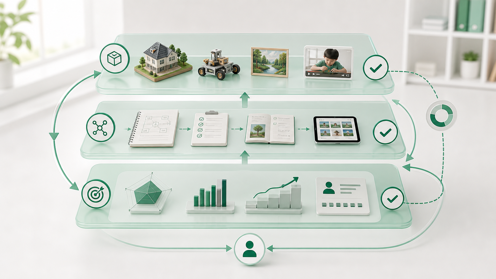
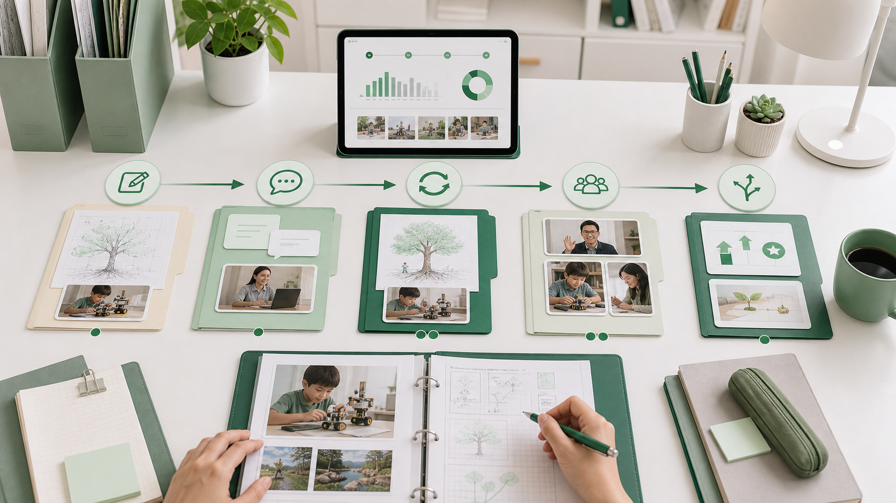

# Module 07: Đánh giá, Portfolio và trách nhiệm giải trình

**Không có đánh giá tốt, homeschooling dễ biến thành cảm giác tiến bộ mà thiếu bằng chứng.**

## 1. First principles

**Bản chất:** Đánh giá là cách nhìn rõ khoảng cách giữa mục tiêu và hiện tại để điều chỉnh hành động. Đánh giá không chỉ để xếp hạng.

**Cơ chế:** Một hệ thống đánh giá tốt có ba phần: chuẩn rõ, bằng chứng thật, phản hồi dẫn đến bước tiếp theo. Portfolio là nơi gom bằng chứng theo thời gian để thấy quá trình, không chỉ kết quả cuối.

| Loại đánh giá | Mục đích | Ví dụ |
|---|---|---|
| Chẩn đoán | Biết điểm xuất phát. | Bài đọc, bài toán nền, phỏng vấn sở thích. |
| Hình thành | Điều chỉnh trong quá trình học. | Nhận xét bản nháp, hỏi miệng, mini quiz. |
| Tổng kết | Xem đạt mục tiêu chưa. | Bài kiểm tra cuối kỳ, sản phẩm dự án, thuyết trình. |
| Chuẩn hóa | So với chuẩn ngoài. | Chứng chỉ, bài thi, đánh giá của trường/mentor. |

## 2. Portfolio cần có gì?

- Mục tiêu học tập theo giai đoạn.
- Sản phẩm thô và sản phẩm đã sửa.
- Nhận xét của phụ huynh, mentor, bạn học hoặc chuyên gia.
- Rubric và mức đạt.
- Nhật ký phản tư của trẻ.
- Bằng chứng xã hội hóa, dự án, hoạt động cộng đồng.
- Ghi chú chuyển tiếp: môn nào tương thích chuẩn nào.

## 3. Rubric mẫu cho bài viết

| Tiêu chí | Mức 1 | Mức 2 | Mức 3 | Mức 4 |
|---|---|---|---|---|
| Ý chính | Mơ hồ | Có ý nhưng tản | Rõ | Rõ và sâu |
| Cấu trúc | Rời rạc | Có mở-thân-kết nhưng yếu | Mạch lạc | Mạch lạc, chuyển ý tốt |
| Bằng chứng | Không có | Có ví dụ chung | Có ví dụ phù hợp | Có ví dụ và phân tích |
| Ngôn ngữ | Nhiều lỗi cản hiểu | Còn lỗi nhưng hiểu được | Tương đối chuẩn | Chính xác, có giọng riêng |

## 4. Trách nhiệm giải trình

Trách nhiệm giải trình không có nghĩa gia đình phải sao chép hệ thống điểm số của trường. Nó nghĩa là có người, chuẩn và bằng chứng để bảo vệ quyền học tập của trẻ. Với bối cảnh Việt Nam, portfolio càng quan trọng nếu gia đình cần chứng minh quá trình học khi chuyển trường, xin vào chương trình quốc tế hoặc làm việc với cơ quan liên quan.

## 5. Bài tập

Tạo portfolio 4 tuần cho một môn:

```text
Môn/năng lực:
Chuẩn hoặc mục tiêu:
Tuần 1 bằng chứng:
Tuần 2 bằng chứng:
Tuần 3 bằng chứng:
Tuần 4 bằng chứng:
Nhận xét của trẻ:
Nhận xét của người lớn:
Bước tiếp theo:
```

## 6. Tình huống ứng dụng

Sau ba tháng homeschooling, phụ huynh nói con “tiến bộ nhiều” vì con vui hơn và đọc nhiều sách hơn. Khi một trường yêu cầu hồ sơ đầu vào, gia đình không có bài viết, bài toán, sản phẩm dự án, nhận xét mentor hay chuẩn đối chiếu.

**Vấn đề thật:** tiến bộ cảm nhận chưa được chuyển thành bằng chứng có thể kiểm tra. Thiếu portfolio làm giảm khả năng điều chỉnh và chuyển tiếp.


*Caption: Hình này giúp người học thấy vì sao cảm giác tiến bộ cần được chuyển thành sản phẩm, phản hồi và hồ sơ có thể trình bày với người ngoài gia đình.*

## 7. Mô hình tư duy: Bằng chứng ba lớp

| Lớp | Câu hỏi | Ví dụ |
|---|---|---|
| Sản phẩm | Trẻ tạo ra gì? | Bài viết, bài giải, mô hình, thuyết trình. |
| Quá trình | Trẻ đã sửa và học ra sao? | Bản nháp, phản hồi, phiên bản mới. |
| Chuẩn | Sản phẩm đạt mức nào? | Rubric, bài chuẩn, nhận xét ngoài. |


*Caption: Ba lớp bằng chứng giúp portfolio không chỉ là nơi lưu ảnh hoạt động, mà là hệ thống chứng minh tiến bộ và quyết định bước tiếp theo.*

## 8. Workflow portfolio 4 tuần

1. Chọn một năng lực trọng tâm.
2. Thu sản phẩm đầu vào tuần 1.
3. Dạy/luyện và phản hồi tuần 2.
4. Yêu cầu phiên bản sửa tuần 3.
5. Nhờ người ngoài gia đình nhận xét tuần 4.
6. Viết kết luận: đạt gì, chưa đạt gì, bước tiếp theo.


*Caption: Hình này giúp phụ huynh theo dõi một năng lực trong bốn tuần: mẫu đầu vào, luyện tập, phiên bản sửa, nhận xét ngoài và quyết định điều chỉnh.*

## 9. Rubric đầu ra

| Mức | Dấu hiệu |
|---|---|
| Chưa đạt | Hồ sơ chỉ là ảnh hoạt động hoặc bài làm rời rạc. |
| Đạt | Có mục tiêu, sản phẩm, nhận xét và lưu theo thời gian. |
| Xuất sắc | Có phiên bản sửa, rubric, phản hồi ngoài, chuẩn đối chiếu và quyết định điều chỉnh chương trình. |
