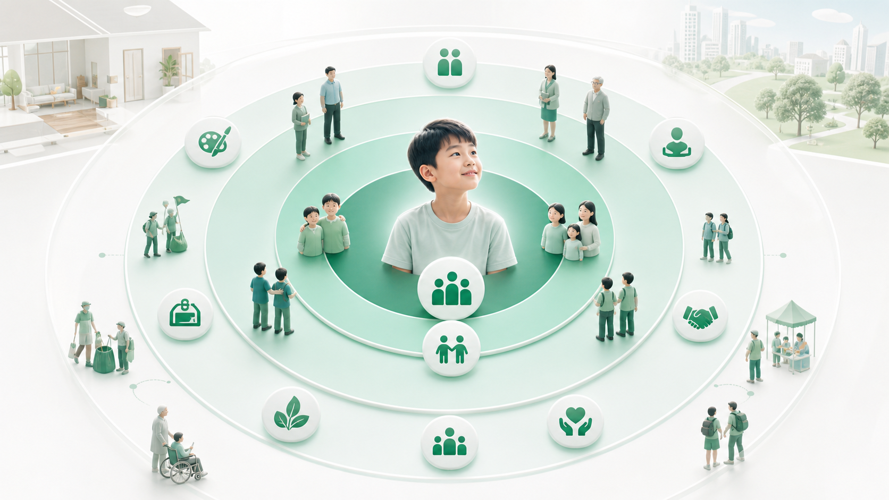

# Module 08: Xã hội hóa, cộng đồng và phát triển nhân cách

**Xã hội hóa không tự động xảy ra trong lớp học, nhưng cũng không tự động xảy ra trong gia đình. Nó phải được thiết kế.**

## 1. First principles

**Bản chất:** Xã hội hóa là quá trình trẻ học sống cùng người khác: lắng nghe, diễn đạt, chia sẻ, thương lượng, hợp tác, xung đột, sửa sai, tôn trọng luật lệ và đóng góp.

**Cơ chế:** Trẻ cần tiếp xúc đều đặn với nhiều kiểu người, nhiều vai trò và nhiều bối cảnh. Một nhóm bạn thân là tốt nhưng chưa đủ; trẻ cũng cần người lớn ngoài gia đình, trẻ nhỏ hơn, trẻ lớn hơn, người khác quan điểm và môi trường có quy tắc chung.

## 2. Các tầng xã hội hóa

| Tầng | Trẻ học gì? | Ví dụ |
|---|---|---|
| Gia đình | Gắn bó, trách nhiệm, việc nhà, xung đột gần. | Chia việc, họp gia đình, chăm sóc em. |
| Bạn ngang tuổi | Chơi, hợp tác, cạnh tranh, đồng cảm. | Nhóm học, thể thao, nghệ thuật. |
| Nhóm đa tuổi | Lãnh đạo, học theo mẫu, giúp đỡ. | Câu lạc bộ, dự án cộng đồng. |
| Người lớn ngoài gia đình | Chuẩn nghề nghiệp, phản hồi khách quan. | Mentor, huấn luyện viên, giáo viên. |
| Xã hội rộng | Luật lệ, dịch vụ, văn hóa, trách nhiệm công dân. | Thư viện, bảo tàng, tình nguyện, sự kiện địa phương. |

## 3. Nhầm lẫn thường gặp

| Nhầm lẫn | Cách hiểu đúng hơn |
|---|---|
| Cứ đến trường là xã hội hóa tốt. | Trường tạo môi trường xã hội, nhưng chất lượng phụ thuộc văn hóa, quan hệ, an toàn. |
| Cứ có anh chị em là đủ xã hội hóa. | Gia đình quan trọng nhưng không thay thế hết xã hội rộng. |
| Học online nhóm là đủ. | Online hữu ích nhưng thiếu nhiều tín hiệu cơ thể, xung đột đời thật, hợp tác vật lý. |
| Trẻ hướng nội không cần bạn. | Hướng nội vẫn cần quan hệ chất lượng và kỹ năng xã hội. |

## 4. Thiết kế mạng xã hội hóa

Mỗi tháng, trẻ nên có:

- Một hoạt động đều đặn với bạn ngang tuổi.
- Một hoạt động vận động hoặc nghệ thuật có huấn luyện viên.
- Một cơ hội hợp tác tạo sản phẩm.
- Một tương tác với người lớn ngoài gia đình có phản hồi tích cực.
- Một trải nghiệm cộng đồng: thư viện, bảo tàng, tình nguyện, dự án địa phương.

## 5. Dấu hiệu cần điều chỉnh

- Trẻ sợ tương tác mới kéo dài và né mọi nhóm.
- Trẻ chỉ giao tiếp với người lớn, không có bạn.
- Trẻ chỉ giao tiếp online.
- Trẻ không biết xử lý xung đột nhỏ.
- Trẻ bị cô lập vì lịch học quá riêng.

Khi dấu hiệu xã hội hoặc cảm xúc kéo dài và gây suy giảm sinh hoạt, gia đình nên tìm chuyên gia tâm lý, giáo dục đặc biệt hoặc bác sĩ phù hợp, thay vì chỉ đổi lịch học.

## 6. Tình huống ứng dụng

Trẻ có nhiều lớp online và một nhóm học cùng hai bạn thân. Phụ huynh tin rằng như vậy đã đủ xã hội hóa. Nhưng khi tham gia hoạt động thể thao, trẻ khó chờ lượt, khó nhận thua và né trao đổi với người lạ.

**Vấn đề thật:** trẻ có tiếp xúc xã hội, nhưng thiếu đa dạng bối cảnh, vai trò, quy tắc và phản hồi. Xã hội hóa cần chất lượng tương tác, không chỉ số lượng người.

*Caption: Hình này nhắc rằng xã hội hóa không chỉ là “có gặp người”, mà là học hợp tác, xung đột, luật nhóm và phản hồi trong bối cảnh thật.*

## 7. Mô hình tư duy: Bản đồ quan hệ 5 vòng

| Vòng | Vai trò | Câu hỏi kiểm tra |
|---|---|---|
| Gia đình | Gắn bó, trách nhiệm, xung đột gần. | Trẻ có việc nhà và tiếng nói không? |
| Bạn thân | Chơi, chia sẻ, thân mật. | Có quan hệ ổn định không? |
| Nhóm ngang tuổi | Hợp tác, cạnh tranh, luật nhóm. | Trẻ có học xử lý bất đồng không? |
| Người lớn ngoài nhà | Chuẩn nghề nghiệp và phản hồi khách quan. | Trẻ có mentor/huấn luyện viên không? |
| Cộng đồng | Công dân, văn hóa, đóng góp. | Trẻ có trải nghiệm nơi công cộng/dự án xã hội không? |

*Caption: Năm vòng quan hệ giúp gia đình kiểm tra trẻ có đủ gia đình, bạn thân, nhóm ngang tuổi, người lớn ngoài nhà và cộng đồng rộng hay chưa.*

## 8. Workflow thiết kế xã hội hóa 30 ngày

1. Vẽ bản đồ 5 vòng hiện tại.
2. Chọn vòng yếu nhất, không chọn hoạt động chỉ vì tiện.
3. Đặt lịch đều đặn ít nhất 4 tuần.
4. Quan sát một kỹ năng xã hội cụ thể: chờ lượt, lắng nghe, hợp tác, xin lỗi, bảo vệ ý kiến.
5. Phản tư với trẻ bằng dữ kiện, không phán xét tính cách.

*Caption: Workflow 30 ngày giúp gia đình chọn vòng quan hệ yếu nhất, đặt lịch đều đặn, quan sát một kỹ năng xã hội và phản tư bằng dữ kiện.*

## 9. Rubric đầu ra

| Mức | Dấu hiệu |
|---|---|
| Chưa đạt | Xã hội hóa được hiểu là “có gặp người”. |
| Đạt | Có hoạt động nhóm đều và quan hệ ngoài gia đình. |
| Xuất sắc | Có bản đồ quan hệ đa tầng, mục tiêu kỹ năng xã hội, phản hồi và điều chỉnh khi trẻ gặp khó khăn. |
